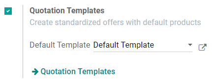
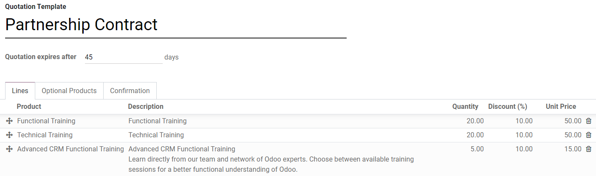

=======================
Use quotation templates
=======================

By creating custom quotation templates, you will save a lot of time. Indeed, with the use of
templates, you will be able to send complete quotations at a fast pace.

Configuration
=============

To enable this feature, go to :menuselection:`Sales --> Configuration --> Settings` and activate
**Quotations Templates**.

Create your first template
==========================

Quotation templates are under :menuselection:`Sales --> Configuration`.

You can create a new template or edit an existing one. Once named, you will be able to select
products and quantities as well as the expiration time of the quotation.

On each template, you can also specify discounts if the option is activated in the *Sales* settings.
The base price is set in the product configuration and can be changed by customer pricelists.

.. seealso::
   - :doc:`../products_prices/prices/pricing`

Edit your template
==================

You can edit the customer interface of the template that they see to
accept or pay the quotation. This lets you describe your company,
services and products. When you click on *Edit Template* you will be
brought to the quotation editor.

.. image:: media/quote_template03.png
   :align: center

.. image:: media/quote_template04.png
   :align: center

This lets you edit the description content thanks to drag & drop of
building blocks. To describe your products add a content block in the
zone dedicated to each product.

.. image:: media/quote_template05.png
   :align: center

.. note::
   The description set for the products will be used in all
   quotations templates containing those products.

Use a quotation template
========================

When creating a quotation, you can select a template.

.. image:: media/quote_template06.png
   :align: center

Each product in that template will be added to your quotation.

.. tip::
   You can select a template to be suggested by default in the
   *Sales* settings.

Confirm the quotation
=====================

Templates also ease the confirmation process for customers with a
digital signature or online payment. You can select that in the template
itself.

.. image:: media/quote_template07.png
   :align: center

Every quotation will now have this setting added to it.

Of course you can still change it and make it specific for each
quotation.

.. seealso::
   - :doc:`get_signature_to_validate`
   - :doc:`get_paid_to_validate`
